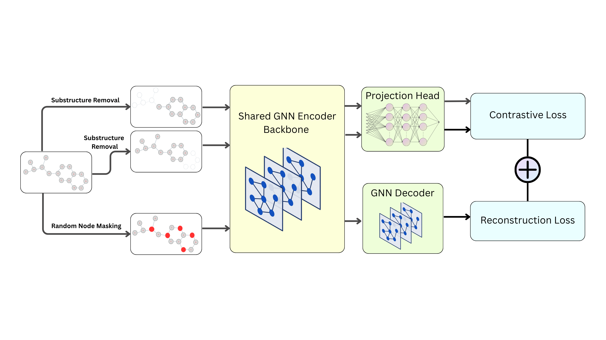

# Moleculer Property Prediction via Local-Global Self-supervised Graph Representation Learning


Implementation of **MolLG**:Moleculer Property Prediction via Local-Global Self-supervised Graph Representation Learning. In this work, we introduced a novel framework for molecular representation learning via dual-objective pre-training. **MolLG** greatly boosts the performance of GNN models on various downstream molecular property prediction benchmarks.
## Getting Started
### Installation
```bash
#create a new environment
conda create --name mollg python=3.12
conda activate mollg
#install requirements
pip install -r requirements.txt
# clone the source code of MolLG
git clone https://github.com/ymy676/MolLG.git
cd MolLG
```
### Pre-training
Run the following scripts to pre-train MolLG.
```bash
python train.py --config configs/gin.yaml
```
### Fine-tuning
Run the following scripts to fine-tune MolLG.
```bash
python finetune.py --config configs/gin.yaml
```
To monitor the training via tensorboard, run `tensorboard --logdir outputs/{PATH}` and click the URL http://127.0.0.1:6006/.
## Acknowledgement
We sincerely thank the authors of the following open-source projects for making their code publicly available:

- MolCLR
- GraphMAE
- Strategies for Pre-training Graph Neural Networks